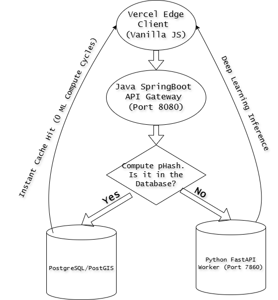

# OpticHash: Distributed Microservices & Compute-Optimized Vision Architecture
---

## Proof of Concept: Hardware-Aware System Telemetry

> [!IMPORTANT]
> ### System Operation Demonstration
> 
> *Click the image above to watch the full end-to-end operation running locally under a multi-container Docker Compose environment.*

---
## System Architecture Topology

> [!NOTE]
> ### System Topology Diagram
> 
> 
> *Figure 1: Complete routing lifecycle of an image request passing from the Vercel edge client, through the Java orchestration gateway, into the C++ memory map, and finally falling back to the Python neural engine.*

### System Design Analysis
As a computer science student diving into enterprise backend systems, I wanted to understand how to build resilient, scalable architectures. This topology illustrates a strict decoupling of the verification process. When an image payload enters the ecosystem, it hits a Java routing gateway. Rather than immediately initializing deep learning compute matrices, the pipeline enforces a critical performance gate: the data drops into a native C++ microservice. If a Perceptual Hash match exists in our local memory map, the system intercepts the asset and exits immediately with zero deep-learning network hops. Novel assets bypass this and route directly to the neural network.

---

## The Core Question: Can We Decouple Machine Learning from Monolithic Compute Waste?

Computer vision pipelines can be an environmental and financial liability. Brute-forcing every incoming image request through heavy convolutional neural networks is a massive over-allocation of resources. If a user uploads an image of a comic book that has already been scanned and cataloged, invoking millions of matrix multiplication operations on a server is completely unnecessary.

I built this distributed, hardware-aware computer vision pipeline as a proof of concept to solve that specific architectural inefficiency. OpticHash uses a two-stage evaluation matrix to guard the machine learning layer. By checking inputs at the byte level before initializing complex neural inference, this project aims to prove that smart software architecture choices can directly reduce electrical overhead and hosting costs.

---

## The Distributed Tech Stack & Architecture

To achieve this performance isolation, I broke the application down into specialized microservices orchestrated via Docker Compose:

* **Zone 1: The Presentation Client (Frontend):** A responsive web application written in standard vanilla JavaScript. It handles automated file preprocessing and explicit telemetry capture.
* **Zone 2: The Core Routing Gateway (Java Spring Boot):** The central traffic controller. It orchestrates service discovery, handles network message serialization, and executes the dynamic cache write-back loops.
* **Zone 3: The Perceptual Bouncer (Native C++):** A high-performance microservice that computes geometric image hashes at the hardware level. If an asset matches, it bypasses the neural network completely, serving data instantaneously and dynamically tracking the exact compute footprint saved.
* **Zone 4: The Edge Neural Brain (Python FastAPI):** Triggered strictly when the C++ gatekeeper encounters a completely new image. It hosts custom computer vision weights and calculates the exact mathematical weight of its own inferences using `fvcore`.

---

## Engineering For Optimized AI Efficiency

The true power of this project lies in how the underlying software architecture protects system resources:

1. **Self-Aware Telemetry:** The Python engine dynamically profiles itself on startup. For our custom 6-class MobileNetV3 model, it identified an exact footprint of 58,631,680 FLOPs (Floating Point Operations). The system passes this telemetry across all three microservices to accurately report how much compute is bypassed on a cache hit. 
2. **INT8 Dynamic Quantization:** Rather than deploying large FP32 weight matrices, the PyTorch model undergoes an aggressive quantization pass via `torchao`. Compressing the neural node values down to 8-bit dynamic integers keeps the volatile memory footprint incredibly low.
3. **The Telemetry Write-Back Loop:** When Python encounters a new image, the Java Gateway catches the resulting metadata and FLOP count, and fires it backward into the C++ memory map. The system actively learns and self-optimizes in real time.

---

## Local Development & Orchestration

This stack is designed to be fully reproducible across environments, running flawlessly on a native Linux VPS or a local machine.

1. **Clone the Repository:**
   - git clone [https://github.com/ishansinha5/OpticHash.git]     (https://github.com/ishansinha5/OpticHash.git)
   - cd OpticHash

2. **Sync the Production Weights**: 
   - Ensure your local folder contains the compiled model binary file under ml-python/weights/comic_vision_int8.pth.

3. **Orchestrate the Container Cluster**: Run the environment cluster using Docker Compose:
   - docker compose up -d --build

4. **Verify Endpoint Status*:
Frontend Application Portal: 
   - cd frontend && python3 -m http.server 3000
   - Java API Gateway Endpoint: http://localhost:8080
   - Python Deep Learning Inference: http://localhost:7860